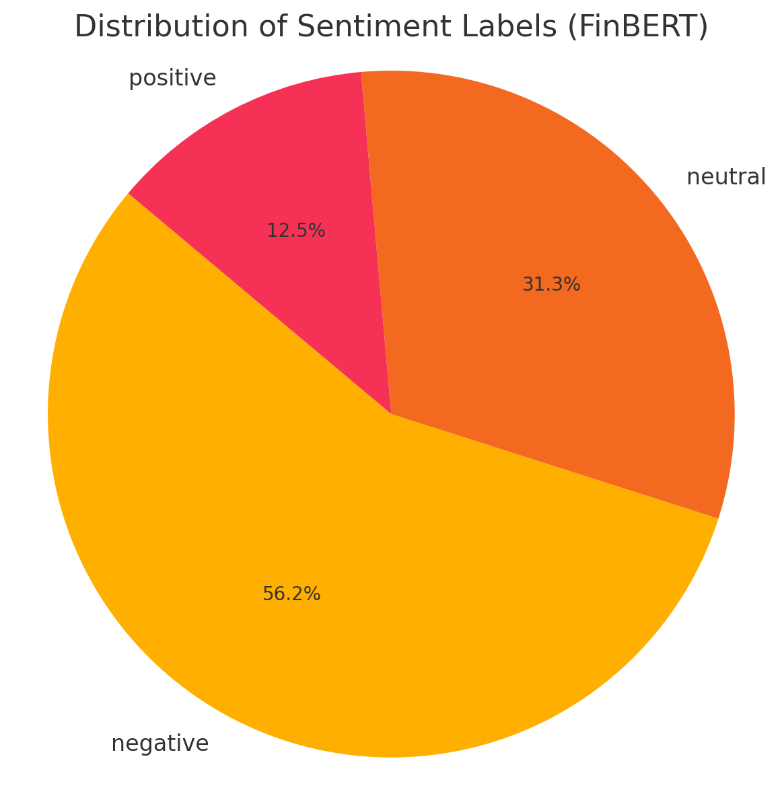

# 📊 Smart Stock Market Prediction & Sentiment Analysis : ALCOA corp. 

This project analyzes and predicts stock prices using historical price data and financial news sentiment.

## 🔍 Features
- Fetches historical stock price data using Yahoo Finance
- Collects recent financial news using NewsAPI
- Merges and prepares data for sentiment and time-series analysis
- Future modules: LSTM forecasting, sentiment scoring, Streamlit dashboard

## 🗂️ Project steps

# PHASE 1: Data Ingestion & Merging
Step	Task	Tools	Output
1.1	Load raw stock & news data	pandas	DataFrames
1.2	Convert Date columns to datetime	pandas	—
1.3	Shift news by +1 day to reflect next-day impact	pandas	—
1.4	Filter news to match only valid trading days	pandas	—
1.5	Group news headlines by date	pandas	Text blob per date
1.6	Merge stock & news data on Date	pandas	merged_stock_news.csv
📁 Code File: src/merger.py
📂 Data Output: data/processed/merged_stock_news.csv

# PHASE 2: Sentiment Analysis (NLP)
Step	Task	Tools	Output
2.1	Apply sentiment analysis on grouped headlines	VADER or FinBERT	Sentiment score per day
2.2	Add sentiment column to merged data	pandas	merged_sentiment.csv
2.3	(Optional) Clean headlines, summarize long texts	nltk / transformers	—
📁 Code File: src/sentiment_analyzer.py
What is VADER?
VADER (Valence Aware Dictionary and sEntiment Reasoner) is a pre-trained sentiment analysis model designed specifically for social media and short texts like news headlines.It outputs a compound score and classifies sentiment based on that score.

✅ Here's the pie chart showing the distribution of sentiment labels predicted by FinBERT on your headlines:
🟧 Negative: 56.2% 
🟠 Neutral: 31.3% 
🔴 Positive: 12.5% 
This reflects a cautious market tone in the financial news related to your stock (Alcoa) — which is realistic in business reporting. 

# PHASE 3: Forecasting Models (ML/DL)
Step	Task	Tools	Output
3.1	Create target variable (next-day Close or classification ↑↓)	pandas	—
3.2	Normalize stock features (MinMaxScaler)	sklearn	—
3.3	Build forecasting model (LSTM, Prophet, etc.)	Keras, Prophet	.h5 or .pkl model
3.4	Evaluate model with RMSE/MAE + trend correlation	sklearn.metrics	metrics.txt
3.5	Save model + scaler	joblib	models/ folder
📁 Code File: src/forecaster.py, src/evaluator.py

A.	LSTM implementation: 
1.	Define Target Variable (What Are We Predicting?)
There are 2 common forecasting objectives:
Target Type	Description	Output Column
Regression (default)	    Predict next day’s Close price	Close_tomorrow
Classification (extra)	    Predict movement: ↑ or ↓ (binary label)	  Direction
We’ll go with Regression first — it's standard and measurable.
2.	We’ll normalize the numeric columns (Open, High, Low, Close, Volume) using MinMaxScaler — important for LSTM and neural networks.
→ Scaler will be saved later using joblib. 
3.	Modeling Options: What We’ll Use and Why
Model	Type	Why use it?	Tools Used
LSTM	Deep Learning	Best for sequential time-series (past → future)	TensorFlow/Keras
Prophet	Statistical	Works great on univariate daily time series	fbprophet
4.	Evaluation Metrics
We’ll track:
•	RMSE (Root Mean Squared Error)
•	MAE (Mean Absolute Error)
•	Optional: Correlation between predicted & actual
Evaluation Summary:
•	✅ RMSE : *3.7604 : This is the average magnitude of error between predicted and actual prices. Lower is better.
•	✅ MAE : 2.6412 : On average, the model’s predicted closing price deviates by about ₹2.64 from the actual price.
•	✅ R² Score (Coefficient of Determination): 0.9412 : This means 94.12% of the variance in stock prices is explained by your model — very strong.

5.	All models and scalers will be saved to the models/ folder:
•	models/lstm_model.h5
•	models/prophet_model.pkl
•	models/scaler.pkl
•	src/forecaster.py	•	Builds & trains models
•	src/evaluator.py	•	Calculates RMSE, MAE, correlation

6.	LSTM done: Summary So Far
Phase	Output
Phase 1:     Merge News + Stock	merged_stock_news.csv
Phase 2:     Sentiment Analysis	merged_sentiment.csv, merged_finbert_sentiment.csv
Phase 3A:  LSTM Forecasting	Model .h5, metrics .txt, plots .png
📁 Preprocessed Input	lstm_input.csv ✅

B.	Transformer-based Time Series Model
1.	Using LSTM_input.csv & finbert_sentiment.csv (recommended but optional but skiped) we are going to implement 
2.	We are trying to use a Transformer for time series regression, not text generation.
3.	Generate sequence file transformer_x & y.npy, Transformer-ready input sequences (X and y)
4.	Next step define and train transformer model using npy files
5.	Transformer model saved to models/transformer_regressor.h5
6.	Evaluate Transformer Model (RMSE, MAE, R²)
7.	RMSE: 0.1679
8.	MAE : 0.1286
9.	R2  : 0.0783
10.	Got this scores : which quite less compare to LSTM because
•  Too little data: Transformers need more data than LSTM to generalize. Transformer performance on small datasets is often unstable.
•  Lack of Positional Embedding: If you skipped this or used it weakly, it may miss time order.
•  Overfitting / underfitting: Could be due to small dataset, insufficient epochs, or architecture mismatch.
•  Feature engineering: Transformer didn’t get FinBERT sentiment or other enriching features.

C.	Random Forest Regressor:
D.	Run script: encoded_sentiment.py and get mertged_finbert_sentiment.csv file
E.	✅ RMSE: 0.7637
F.	✅ MAE : 0.5880
G.	✅ R²  : 0.9942

# PHASE 4: Streamlit Web App
Step	Task	Tools	Output
5.1	Display stock chart, sentiment trend	Streamlit + Plotly	interactive chart
5.2	Allow date range selector	Streamlit	user control
5.3	Show prediction output	Streamlit	future values
5.4	Display related headlines and sentiment	Streamlit	news insight
5.5	Add download/export button (optional)	Streamlit	CSV
📁 Code File: app/stremlit_app.py 

